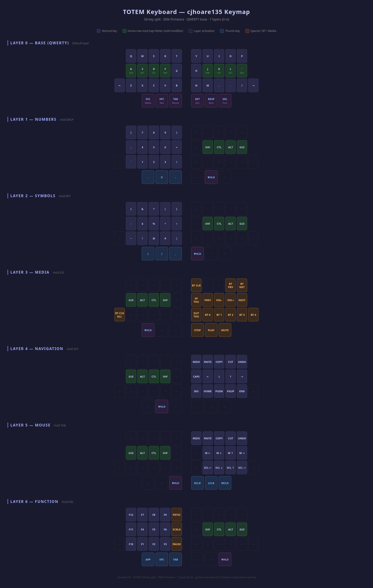

# TOTEM Keyboard — cjhoare135 Keymap

A custom ZMK firmware configuration for the [TOTEM](https://github.com/GEIGEIGEIST/zmk-config-totem) 38-key split keyboard. QWERTY base with Miryoku-style layers and home row mods.

---

## How it works

- Edit `config/totem.keymap` to change key assignments
- Push your changes to GitHub
- GitHub Actions automatically compiles the firmware
- Download the `.uf2` files from the Actions tab and flash to the keyboard

---

## Keymap Reference

---

## Flashing the keyboard

1. Go to the [Actions tab](../../actions) on GitHub
2. Click the latest successful build and scroll down to **Artifacts**
3. Download and unzip `firmware.zip`
4. Connect the **left half** to your PC and double-tap the reset button — it will appear as a USB drive
5. Drag and drop `totem_left-seeeduino_xiao_ble-zmk.uf2` onto it
6. Repeat with the **right half** and `totem_right-seeeduino_xiao_ble-zmk.uf2`

---

## Resources

- [ZMK Documentation](https://zmk.dev/docs)
- [ZMK Keycodes](https://zmk.dev/docs/codes)
- [TOTEM keyboard](https://github.com/GEIGEIGEIST/zmk-config-totem)
- [Miryoku layout](https://github.com/manna-harbour/miryoku)
- [Actions tab](../../actions)

---

*cjhoare135 · TOTEM 38-key split · ZMK firmware · 7 layers (0–6)*
